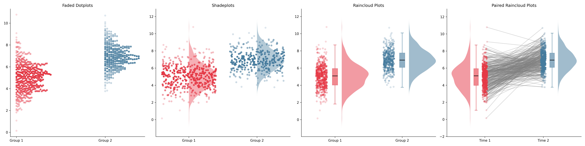

# Paircloud ☔️

A hybrid Python/Rust package for creating beautiful, transparent data graphs, particularly faded dotplots, shadeplots, and classic raincloud plots.

Inspired by [Dallas Novakowski's blog post](https://dallasnova.rbind.io/post/creating-simple-and-transparent-data-graphs-using-faded-dotplots-and-shadeplots/) and [jorvlan/raincloudplots](https://github.com/jorvlan/raincloudplots).

Paircloud leverages a fast **Rust** backend (via `pyo3` and `ndarray`) for computing Kernel Density Estimations (KDE) and an intuitive **Python** API (via `matplotlib`) for rendering the visual components.

## Installation

You can install Paircloud using `uv`:

```bash
uv pip install -e .
```



## Features

- **Faded Dotplots**: Stacked data points that systematically fade (alpha mapping) based on their distance from the distribution's mode or median, preventing overplotting.
- **Shadeplots**: Density slabs (half-violins) combined with faded dotplots to represent raw data and distributional summaries transparently.
- **Raincloud Plots**: The ultimate combination of a half-violin, a boxplot for summary statistics, and jittered individual points for full data transparency.
- **Paired Rainclouds**: Visualize clustered, repeated measures data with matched-jitter connective lines safely overlaid between two distinct populations.

## Fast Rust Backend
Traditional KDE plots can be slow for large datasets. Paircloud delegates the intensive O(N×M) density evaluations to compiled Rust via `paircloud._paircloud_rs.calc_kde`.

## Example Usage

```python
import numpy as np
import matplotlib.pyplot as plt
import paircloud

# 1. Generate Fake Data
group1 = np.random.normal(loc=5, scale=1.5, size=400)
group2 = np.random.normal(loc=7, scale=1.2, size=300)

fig, axes = plt.subplots(1, 4, figsize=(24, 6))

# 2. Draw Faded Dotplots
ax = axes[0]
paircloud.faded_dotplot(group1, ax=ax, color="#E63946", position=1, orientation="v")
paircloud.faded_dotplot(group2, ax=ax, color="#457B9D", position=2, orientation="v")
ax.set_title("Faded Dotplots")

# 3. Draw Shadeplots
ax = axes[1]
paircloud.shadeplot(group1, ax=ax, color="#E63946", position=1, orientation="v")
paircloud.shadeplot(group2, ax=ax, color="#457B9D", position=2, orientation="v")
ax.set_title("Shadeplots")

# 4. Draw Classic Rainclouds
ax = axes[2]
paircloud.raincloud(group1, ax=ax, color="#E63946", position=1, orientation="v")
paircloud.raincloud(group2, ax=ax, color="#457B9D", position=2, orientation="v")
ax.set_title("Raincloud Plots")

# 5. Paired Raincloud
ax = axes[3]
paired1 = group1[:300]
paired2 = group2[:300]
paircloud.paired_raincloud(paired1, paired2, ax=ax, colors=("#E63946", "#457B9D"), positions=(1, 2), orientation="v")
ax.set_title("Paired Rainclouds")

plt.show()
```
